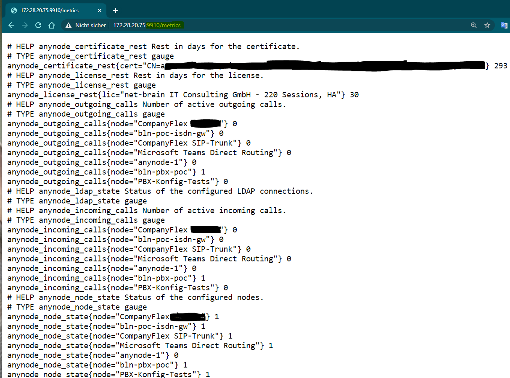

# anynode exporter for prometheus
Anynode Exporter for prometheus is used to monitor anynode SBC systems from TE-Systems. It provides an interface for the prometheus monitoring system (http://prometheus.io) for this purpose. For the overall system you therefore need:

 - anynode (tested with 4.4.2)
 - anynode exporter
 - prometheus
 - grafana (optional)
# Installation
The easiest way to install is using Docker. To do this, proceed as follows:
 - Install docker and docker-compose on the target server.
 - create a directory and copy the file `docker-compose.yml` into it.
 - Create a subdirectory `prometheus` in this directory and copy the file` prometheus.yml` into it.
 - Adjust the environment variables in the `docker-compose.yml`.

# Configuration of the docker-compose file
The program needs the following settings:
- The username of an administrator of anynode
- The matching password
- The URL under which anynode can be reached.

All entries are made here using an environment variable. A change or replacement of the appsettings file is also possible. The environment variables must always start with 'ae_'.
The above information can be found under environment:

``` 
environment:
   - "ae_Anynode__User = anadmin"
   - "ae_Anynode__Password = secret"
   - "ae_Anynode__Url = https://192.168.178.10"
```
# Starting and stopping the system
You can start the system by entering `docker-compose up -d`. This must be done in the directory in which the file `docker-compose.yml` is located.
To stop docker-compose down to exit normally, or docker-compose down --rmi all to exit and remove the execution data. For further commands please consult the documentation of docker-compose.
When Anynodeexporter and prometheus have started, you can check the operational readiness by calling the URL http://servername:9910/ metrics. The anynode nodes should now be 

# Read out the data with prometheus
Prometheus reads the data from the configured exporters in a regular cycle. Prometheus then saves the data in its own database. Prometheus is configured in prometheus.yml
```
global:
  scrape_interval: 15s # By default, scrape targets every 15 seconds.

  # Attach these labels to any time series or alerts when communicating with
  # external systems (federation, remote storage, alert manager).

# A scrape configuration containing exactly one endpoint to scrape:
scrape_configs:
  # The job name is added as a label `job = <job_name>` to any timeseries scraped from this config.
  - job_name: 'anynode'
    # Override the global default and scrape targets from this job every 30 seconds.
    scrape_interval: 30s
    static_configs:
      - targets: ['anynodeexporter: 9910']
```
Note that the URL `anynodeexporter: 9910` is derived from the name given in the` docker-compose.yml` under `services`.

# Exporter's metrics
Anynodeexporter reads the following metrics from anynode:
 - Nodes and their status (anynode_node_state)
 - Incoming calls per node (anynode_incoming_call)
 - Outgoing calls per node (anynode_outgoing_call)
 - LDAP connections (anynode_ldap_state)
 - anynode license remaining term (anynode_license)
 - Remaining term (days) of the certificates (anynode_certificate)

The actual system load (CPU, RAM, hard disk) cannot currently be read out because the anynode REST API does not yet provide this data.

From here the data can be processed further. This can be done e.g. with the help of Grafana (https://www.grafana.com). Among other things, Grafana can visualize prometheus data in the form of dashboards.
